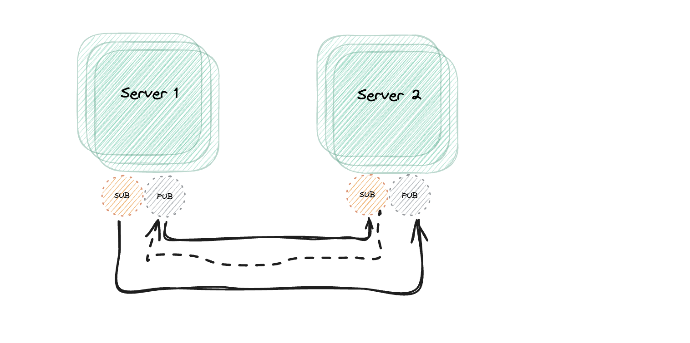
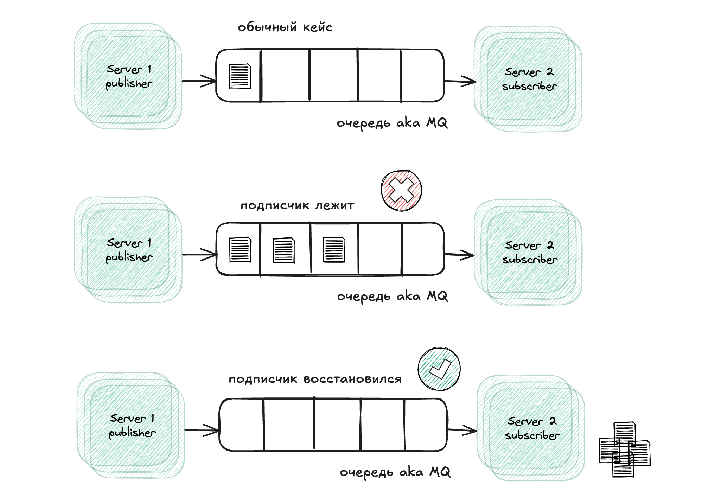
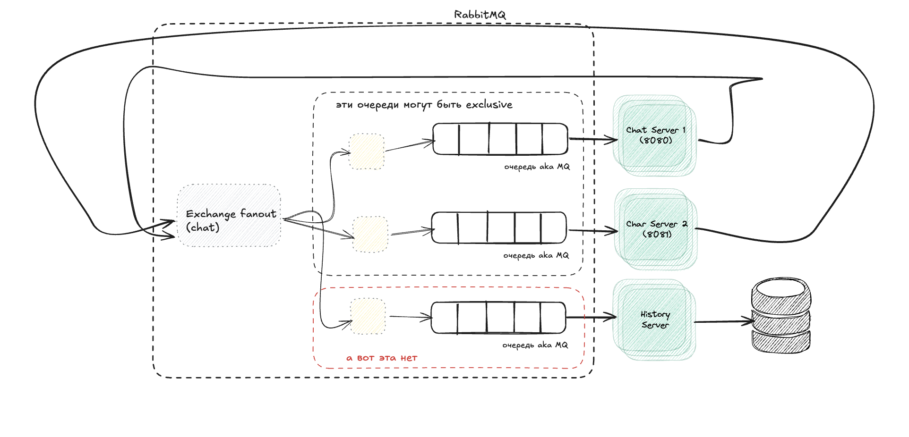
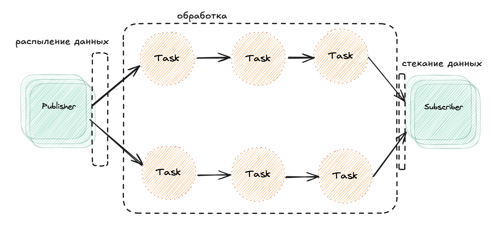
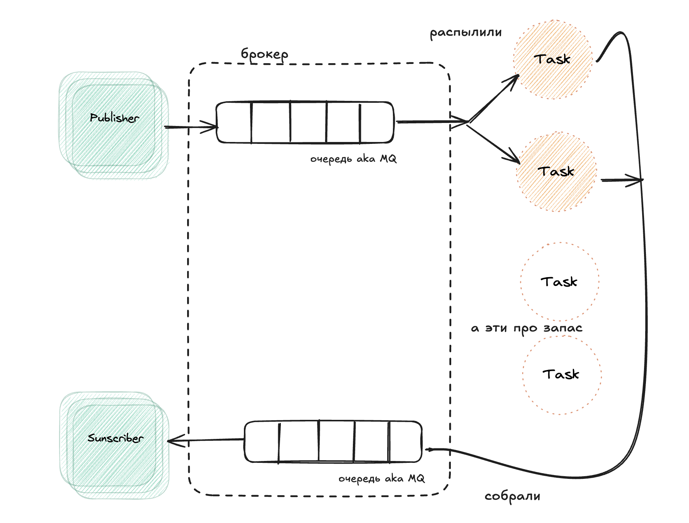

# Корни проблемы

Нужно несолько сервисов, чтобы показать проблему.

Пишем простой сервер на сокетах:

```js
import { createServer } from 'http'
import staticHandler from 'serve-handler'
import ws, {WebSocketServer} from 'ws'

const server = createServer((req, res) => {
  return staticHandler(req, res, { public: 'www' })
})

const wss = new WebSocketServer({ server })
wss.on('connection', client => {
  console.log('Client connected')
  client.on('message', msg => {
    console.log(`Message: ${msg}`)
    broadcast(msg)
  })
})

function broadcast (msg) {
  for (const client of wss.clients) {
    if (client.readyState === ws.OPEN) {
      
      client.send(msg.toString())
      console.log(`Message successfully sent to client: ${msg}`);
    }
  }
}

server.listen(process.argv[2] || 8080)

```
И такой клиент для него:

```js
<!DOCTYPE html>
<html>
  <body>
    Messages:
    <div id="messages"></div>
    <form id="msgForm">
      <input type="text" placeholder="Send a message" id="msgBox"/>
      <input type="submit" value="Send"/>
    </form>
    <script>
      const ws = new WebSocket(
        `ws://${window.document.location.host}`
      )
      ws.onmessage = function (message) {
        console.log(message, 'mes')
        const msgDiv = document.createElement('div')
        msgDiv.innerHTML = message.data
        document.getElementById('messages').appendChild(msgDiv)
      }
      const form = document.getElementById('msgForm')
      form.addEventListener('submit', (event) => {
        event.preventDefault()
        const message = document.getElementById('msgBox').value
        ws.send(message)
        document.getElementById('msgBox').value = ''
      })
    </script>
  </body>
</html>
```

### Проблема
Запустим сервер и откроем две вкладки на 8080 и получим работающий чат — клиенты общаются. А откроем ещё один на 8081 порту и он запустится изолировано, без доступа к сообщениям на 8080.

Тут и понадобится очередь.

## Очередь на Redis

В такой конфигурации серевера очередь или шину данных будет предоставлять Redis:

```js
import { createServer } from 'http'
import staticHandler from 'serve-handler'
import ws, {WebSocketServer} from 'ws'
import Redis from 'ioredis'

const redisSub = new Redis()
const redisPub = new Redis()

// serve static files
const server = createServer((req, res) => {
  return staticHandler(req, res, { public: 'www' })
})

const wss = new WebSocketServer({ server })
wss.on('connection', client => {
  console.log('Client connected')
  client.on('message', msg => {
    console.log(`Message: ${msg}`)
    redisPub.publish('chat_messages', msg)
  })
})

redisSub.subscribe('chat_messages')
redisSub.on('message', (channel, msg) => {
  for (const client of wss.clients) {
    if (client.readyState === ws.OPEN) {
      client.send(msg)
    }
  }
})

server.listen(process.argv[2] || 8080)
```

Наконец, все создаваемые инстансы сервера подключеются через sub к этой шине.
В качестве пруфов можно пачатиться на троих:
```js
node index_redis.js 8080
node index_redis.js 8081
node index_redis.js 8082
```

Все подписанты (sub) получат, то что было в pub.

## Очередь на ZeroMQ

Вообще, общение через очередь наклдывает определённые риски:
- задержка доствки (тк есть шан обшение через очередь)
- очердь является единой точкой отказа. Падает очередь падает всё.

Попробуем оргнизовать общение меду сервисами на базе одноранговой сети ака peer-to-peer.

Мы убираем брокер в виде редиса и соединяем сервисы напрямую через узлы PUB/SUB, которые предоставляет ZeroMQ

```js
import { createServer } from 'http'
import staticHandler from 'serve-handler'
import ws, { WebSocketServer } from 'ws'
import yargs from 'yargs'
import { hideBin } from 'yargs/helpers'
import zmq from 'zeromq'

const server = createServer((req, res) => {
  return staticHandler(req, res, { public: 'www' })
})

console.log(yargs(hideBin(process.argv)).argv)

let pubSocket
async function initializeSockets () {
  pubSocket = new zmq.Publisher()
  await pubSocket.bind(`tcp://127.0.0.1:${yargs(hideBin(process.argv)).argv.pub}`)

  const subSocket = new zmq.Subscriber()
  const subPorts = [].concat(yargs(hideBin(process.argv)).argv.sub)
  for (const port of subPorts) {
    console.log(`Subscribing to ${port}`)
    subSocket.connect(`tcp://127.0.0.1:${port}`)
  }
  subSocket.subscribe('chat')

  for await (const [msg] of subSocket) {
    console.log(`Message from another server: ${msg}`)
    broadcast(msg.toString().split(' ').slice(1).join(' '))
  }
}

initializeSockets()

const wss = new WebSocketServer({ server })
wss.on('connection', client => {
  console.log('Client connected')
  client.on('message', msg => {
    console.log(`Message: ${msg}`)
    broadcast(msg)
    pubSocket.send(`chat ${msg}`)
  })
})

function broadcast (msg) {
  for (const client of wss.clients) {
    if (client.readyState === ws.OPEN) {
      client.send(msg)
    }
  }
}

server.listen(yargs(hideBin(process.argv)).argv.http || 8080)
```



В такой архитектуры в самих нодах сервисов "просверливаются" сокеты для подписки. B и получается, что каждый сервис может подписаться хоть на одну, хот на все ноды-соседи. В отличие от Redis, здесь ZMQ работает напрямую между нодами, что убирает центральную точку отказа.

## Гарантии доставки

Мы подходим к важному понятию — очередь сообщений (Message Queue, MQ).

- Отправитель и получатель сообщения не обязаны быть активны одновременно, чтобы успешно обменяться данными.
- Очередь сообщений берёт на себя задачу хранения сообщений, пока получатель не сможет их забрать.

Полная противоположность методу fire-and-forget (отправил и забыл). Здесь получатель может получить сообщение только тогда, когда он подключён к системе обмена сообщениями. Если его нет — сообщение потеряется.

В общем нам нужны _гарантии_, что подписчик получит сообщение, даже, если какое-то время был отключен.

Отсюда вытакают такие столпы отправки сообщений, как:
- At most once (Не более одного раза):
    - Это вариант fire-and-forget.
    - Сообщение не сохраняется и доставка не подтверждается.
    - Если получатель отключится или произойдёт сбой, сообщение будет потеряно.

- At least once (Не менее одного раза):
    - Сообщение гарантированно будет доставлено хотя бы один раз.
    - Но возможны дубликаты, если, например, получатель отключился до того, как подтвердил, что получил сообщение.
    - Для этого требуется сохранять сообщение (например, в памяти или на диске), чтобы отправить его повторно при необходимости.

- Exactly once (Ровно один раз):
    - Нет ничего надёжнее!
    - Гарантируется, что сообщение будет доставлено ровно один раз.
    - Это достигается за счёт сложных и медленных механизмов подтверждения доставки, которые требуют больше ресурсов.

Стоит выбирать подходы at least once или exactly once с использованием персистентных очередей (хранить где-то на диске/persistent volume)

Вот, что верхнеуровнево мы должны получить:


То есть, что бы не произолошо с подписчиком, он должен получить сообщения, которых не досчитался.

## AMQP

Одного Redis'а или zeromq недостаточно, чтобы построить ALO/EO варианты доставки.
Тут на помощь выходит AMQP. 
Базово очереди, работающие на AMQP-протоколе выглядят так:




Концепция AMQP расширяет уже извествую нам сущность (queue):

Сообщения из очереди могут быть:

- Отправлены (push) к одному или нескольким потребителям.
- Запрошены (pull) потребителем.

Типы очередей:

- Durable (Устойчивая):
Очередь автоматически создаётся заново, если брокер перезапустится.
Однако, чтобы сохранить сами сообщения, они должны быть отмечены как персистентные — тогда они записываются на диск и восстанавливаются при рестарте.

- Exclusive (Эксклюзивная):
Очередь связана с одним конкретным подключением. Когда соединение закрывается, очередь удаляется.

- Auto-delete (Самоудаляющаяся):
Очередь удаляется, когда отключается последний подписчик

И вводятся дополнительный сущности: Exchange и Bindings.


Exchange — это точка, где сообщение публикуется.
Exchange отвечает за маршрутизацию сообщений в одну или несколько очередей в зависимости от заданного алгоритма:

- Direct exchange (Прямой обмен):
Сообщение отправляется в очередь, если ключ маршрутизации (routing key) полностью совпадает с заданным (например, chat.msg).

- Topic exchange (Тематический обмен):
Сообщения распределяются по шаблону (например, chat.# отправит сообщение всем маршрутам, начинающимся с chat.).

- Fanout exchange (Широковещательный обмен читай броадкастинг):
Сообщение отправляется во все подключённые очереди, игнорируя ключ маршрутизации.


Binding определяет связь между обменником и очередью. Binding также задаёт:

- Ключ маршрутизации (routing key) или шаблон для фильтрации сообщений, которые поступают из exchange'ра в очередь.


По сути у очередей появлявеся предбанник в виде Exchange и Bindings.

## AMQP через RabbitMQ

RabbitMQ это уже полноценный брокер. Его можно натравить на "обмен сообщениями" уже между совсем разными сервисами. Раньше примеры была на однородных chat-like сервисах.





Тут явно видно, что "очереди чатов" могут быть эксклюзиными — отключились, ла и чёрт с ними. Восттановим из истории. А вот "очередь истории", как раз должны быть durale — на ней вся работа по сохранению и востановлению сообщений.

Реализация:

```js

import { createServer } from 'http'
import staticHandler from 'serve-handler'
import ws from 'ws'
import amqp from 'amqplib'
import JSONStream from 'JSONStream'
import superagent from 'superagent'

const httpPort = process.argv[2] || 8080

async function main () {
  const connection = await amqp.connect('amqp://localhost')
  const channel = await connection.createChannel()
  await channel.assertExchange('chat', 'fanout')
  const { queue } = await channel.assertQueue(
    `chat_srv_${httpPort}`,
    { exclusive: true }
  )
  await channel.bindQueue(queue, 'chat')
  channel.consume(queue, msg => {
    msg = msg.content.toString()
    console.log(`From queue: ${msg}`)
    broadcast(msg)
  }, { noAck: true })

  // serve static files
  const server = createServer((req, res) => {
    return staticHandler(req, res, { public: 'www' })
  })

  const wss = new ws.Server({ server })
  wss.on('connection', client => {
    console.log('Client connected')

    client.on('message', msg => {
      console.log(`Message: ${msg}`)
      channel.publish('chat', '', Buffer.from(msg))
    })

    // query the history service
    superagent
      .get('http://localhost:8090')
      .on('error', err => console.error(err))
      .pipe(JSONStream.parse('*'))
      .on('data', msg => client.send(msg))
  })

  function broadcast (msg) {
    for (const client of wss.clients) {
      if (client.readyState === ws.OPEN) {
        client.send(msg)
      }
    }
  }

  server.listen(httpPort)
}

main().catch(err => console.error(err))
```

Дополнительно нам нужна реализация сервиса "истории":

```js
import { createServer } from 'http'
import level from 'level'
import timestamp from 'monotonic-timestamp'
import JSONStream from 'JSONStream'
import amqp from 'amqplib'

async function main () {
  const db = level('./msgHistory')

  const connection = await amqp.connect('amqp://localhost')
  const channel = await connection.createChannel()
  await channel.assertExchange('chat', 'fanout')
  const { queue } = channel.assertQueue('chat_history')
  await channel.bindQueue(queue, 'chat')

  channel.consume(queue, async msg => {
    const content = msg.content.toString()
    console.log(`Saving message: ${content}`)
    await db.put(timestamp(), content)
    channel.ack(msg)
  })

  createServer((req, res) => {
    res.writeHead(200)
    db.createValueStream()
      .pipe(JSONStream.stringify())
      .pipe(res)
  }).listen(8090)
}

main().catch(err => console.error(err))
```

### Пайплайны

Раз очередей может быть несоколько, то почему бы не попробовать распараллетить какие-то задачи? Казалось бы — самое очевидное применение очередей. Базово имеется в виду это:



Получается, есть какая-то фаза "раскидывания/распыления" данных по очередям, фаза обработчки данных, и фаза обратного "стекания" данных в одну точку.
Обратие внимание на формулировки, они именно такое: распыление/стекание — они передают суть того, что все очереди работают согласованно для одной точки, в отличие от примеров выше, где очереди работали на конкретного подписанта.

## Exchange

Тут возникает проблема — нужно, как то гарнтировать, что конкретное сообщение попадёт/рвспылится в нужную очередь иначе задачи распаралеллятся неравномерно, что противоречит самой концепции параллельности. Возникает такой алгоритм:

- У нас есть очередь задач с именем tasks_queue.
- В этой очереди накапливаются задачи.
- Три worker-а (консьюмера) слушают эту очередь.
- Когда поступает новая задача, только один консьюмер получает ее (остальные ждут следующую задачу).
Таким образом, задачи равномерно распределяются между worker-ами.

Это по сути изобретение "горизонтального масштабирования" — если ужно обработать больше задач, то просто добавь нового воркера.



Кружки с белым фонов это как раз места для потенциального масташбирования. Увеличется поток из очереди — просто добавим новые воркеры, другая архитектура при этом не изменится.

## Минусы

- Сложность дебага и мониторинга
  - Нельзя просто "увидеть" запрос
  - Где потерялось сообщение? 
  - нужно строить отдельно мониторинг managment с графаной прометуесом итд

- Сетевые задержки 
  - Брокеры же тоже работают через сеть. На этои всё.
  - если сервис отправляет миллионы сообщений, брокер может перегрузить сеть.
  - задержки

- Гарантированная только один раз = Сложность. Один этот пункт сложность сама по себе
  - почти из коробки есть только в Kafka (через двух фазный коммит между БД и Кафкой)
  - для всех решеий по любому ещё нужен кластер на обработку

- Оверхед на инфраструктуру
  - Брокеры тоже нужно скалировать
  - retention, cleanup, DLQ, failover

📌 4. Итоговая формула Exactly-once (Agnostic)
1️⃣ Генерируем message_id (UUID, hash запроса).
2️⃣ Гарантируем at-least-once delivery (повторные отправки, пока нет ACK).
3️⃣ Идемпотентность обработки (message_id в хранилище).
4️⃣ Атомарное коммитирование (обработка + запись message_id в одной транзакции).
5️⃣ Fault Tolerance & Recovery (если консьюмер падает → брокер выдаёт сообщение снова).

✅ Работает с любым брокером (Kafka, RabbitMQ, Redis Streams, AWS SQS).
✅ Можно реализовать на любом стеке (PostgreSQL, MySQL, Redis, Cassandra).
